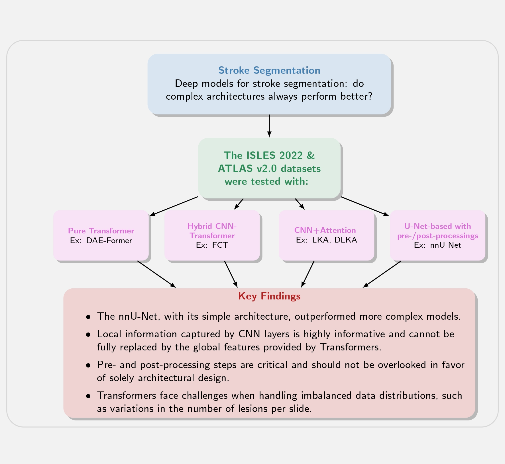
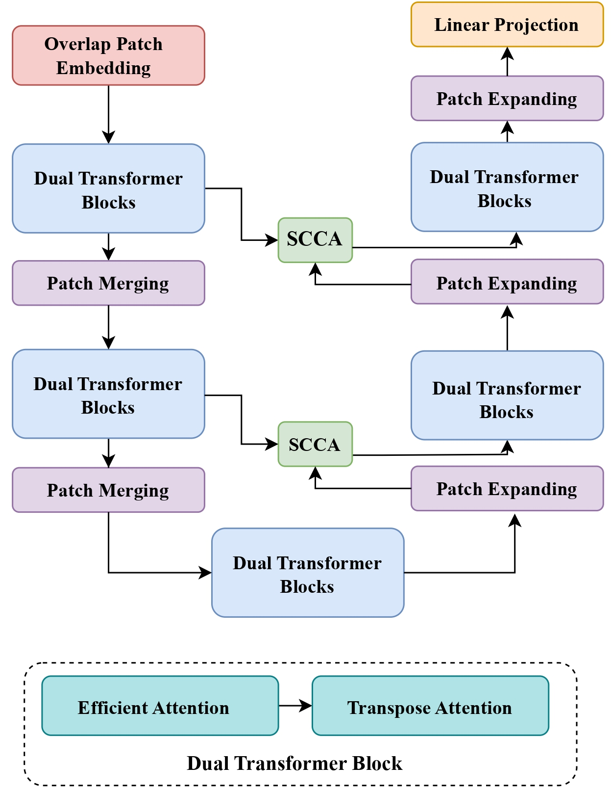
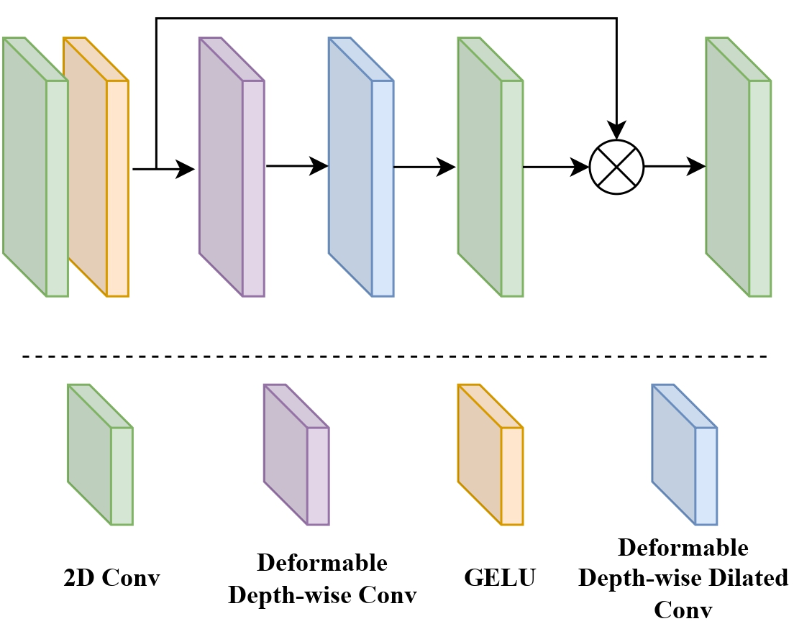
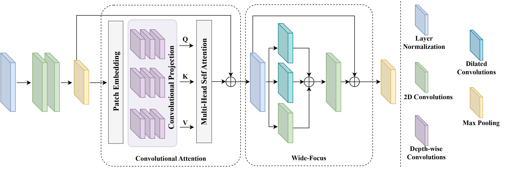
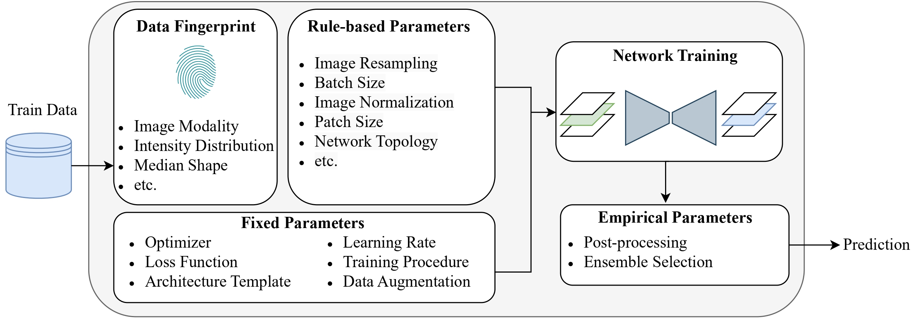
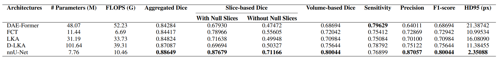
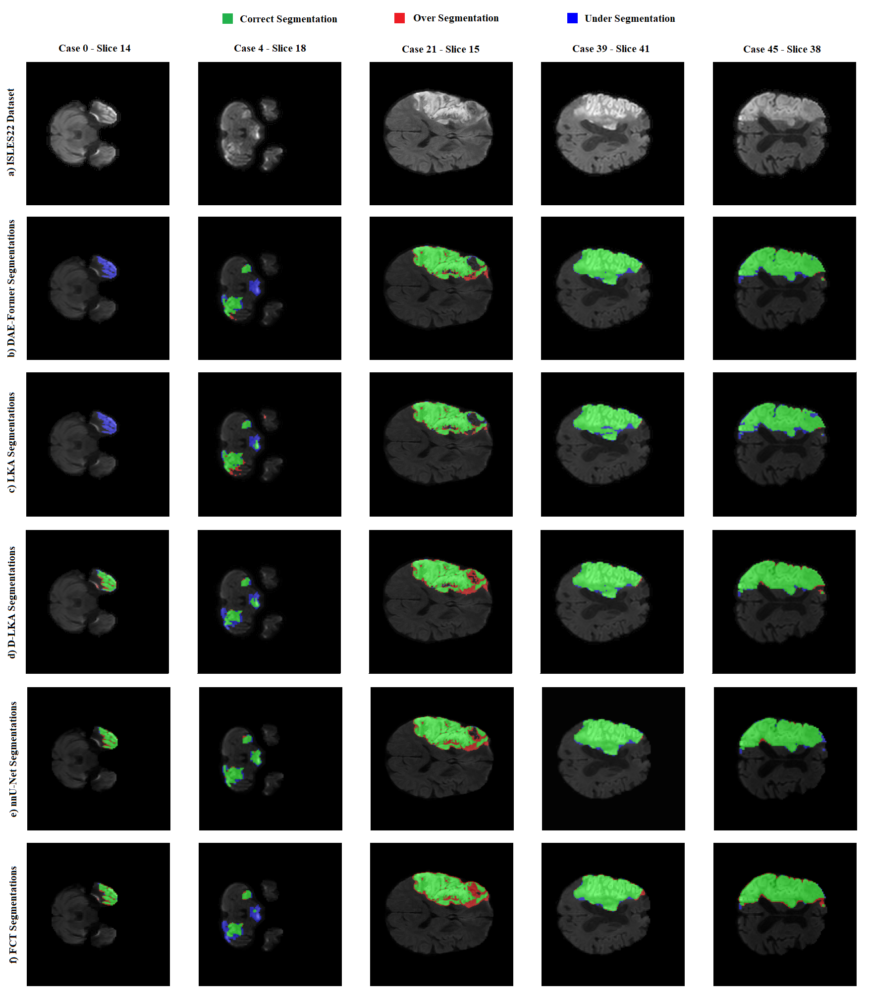
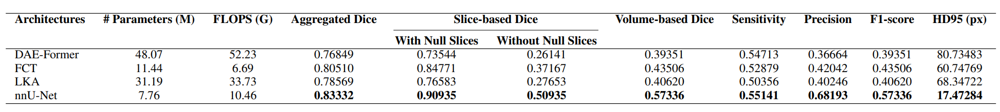
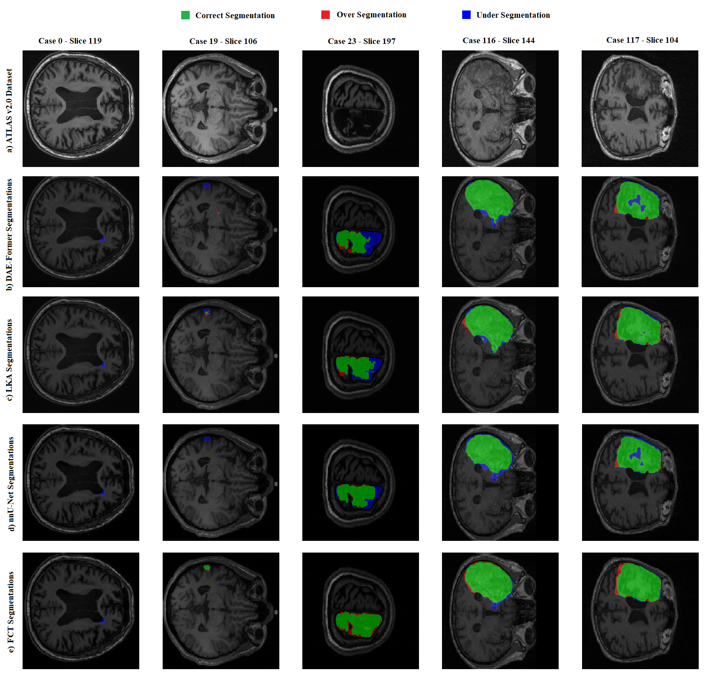

# 
`Deep Models for Stroke Segmentation: Do Complex Architectures Always Perform Better?`
 #

This repository summarizes the results of our paper, "Deep Models for Stroke Segmentation: Do Complex Architectures Always Perform Better?" The paper evaluates the effectiveness of various deep learning models for stroke lesion segmentation and explores whether complex architectures consistently outperform simpler designs.

 

## Updates
- Initial release on arXiv: [Deep models for stroke segmentation: do complex architectures always perform better?](https://arxiv.org/abs/2403.17177)
- Our review paper on Artificial Intelligence Review: [Transformers-based architectures for stroke segmentation: a review](https://link.springer.com/article/10.1007/s10462-024-10900-5)

## Table of Content
- [Deep Models](#deep-models)
  - [DAE-Former](#dae-former)
  - [LKA and DLKA](#lka-and-dlka)
  - [FCT](#fct)
  - [nnU-Net](#nnu-net)
- [Datasets](#datasets)
- [Results](#results)
  - [ISLES 2022](#isles_results)
  - [ATLAS v2.0](#atlas_results)
- [Key Findings](#key-findings)
- [Links to Resources](#links-to-resources)

## Deep Models

### DAE-Former
[Dual Attention-guided Efficient Transformer (DAE-Former)](https://github.com/xmindflow/DAEFormer) is a pure Transformer-based U-shape architecture designed for medical image segmentation. This architecture incorporates three types of attention mechanisms: (1) efficient attention, (2) transpose attention, and (3) cross attention. Dual-attention blocks were capturing both spatial and channel information by incorporating efficient attention and transpose attention. Skip-connection cross-attention (SCCA) was employed to suppress irrelevant regions in the image during training and highlight significant features for the segmentation task.

### LKA and DLKA
[LKA (Large Kernel Attention)](https://github.com/xmindflow/deformableLKA) employs convolutional kernels larger than those in traditional methods, capturing a broader contextual view similar to the receptive fields in Transformers. LKA achieves this expanded field of view with fewer parameters compared to self-attention utilizing a combination of depth-wise and dilated convolutions. [Deformable Large Kernel Attention (DLKA)](https://github.com/xmindflow/deformableLKA) introduces the ability to dynamically adjust the sampling grid in LKA by replacing some convolutional layers with deformable convolutions to facilitates an adaptive convolution kernel capable of flexibly adjusting its shape to better represent complex anatomical structures.

### FCT
[Fully convolutional Transformer (FCT)](https://github.com/Thanos-DB/FullyConvolutionalTransformer) is a hybrid CNN-Transformer architecture which incorporates CNN layers into the architecture of Transformers to leverage CNNs’ ability to represent image features and Transformers’ capability to model long-range dependencies. The output of the Transformer block is then processed through the Wide-Focus module, which is a multi-branch convolutional paradigm.

### nnU-Net
[The no new U-Net (nnU-Net)](https://github.com/MIC-DKFZ/nnUNet) framework is a self-configuring tool based on U-Net architecture without any need for manual tuning, simplifying key aspects from preprocessing to post-processing with minimal human involvement. It has demonstrated its effectiveness by surpassing existing methods across 23 public datasets, highlighting its adaptability and resilience in diverse segmentation tasks.

## Datasets
We used two publicly accessible datasets for stroke segmentation to ensure sufficient data diversity and volume for training deep neural networks:

1. ISLES 2022:
  - Contains 400 MRI cases (250 public, 150 private).
  - Features diverse infarct patterns and imaging from three medical centers.
  - Includes DWI, ADC, and FLAIR modalities (we used DWI images only).

2. ATLAS v2.0:
  - Includes 955 T1-weighted MRI cases (655 public with lesion masks, 300 without).

## Results

###  ISLES 2022

###  ATLAS v2.0

##  Key Findings
- The nnU-Net, with its simple architecture, outperformed more complex models.
- Local information captured by CNN layers is highly informative and cannot be fully replaced by the global features provided by Transformers for stroke segmentation.
- Pre- and post-processing steps are critical and should not be overlooked in favor of solely architectural design.
- Transformers face challenges when handling imbalanced data distributions, such as variations in the number of lesions per slide.
- A thoughtful integration of CNN layers and Transformers is crucial for enhancing the performance of deep models in stroke segmentation.
  
## Links to Resources
- [DAE-Former Repository](https://github.com/xmindflow/DAEFormer)
- [LKA/DLKA Repository](https://github.com/xmindflow/deformableLKA)
- [FCT Repository](https://github.com/Thanos-DB/FullyConvolutionalTransformer)
- [nnU-Net Repository](https://github.com/MIC-DKFZ/nnUNet)
- [ISLES 2022 Dataset](https://isles22.grand-challenge.org/)
- [ATLAS v2.0 Dataset](https://atlas.grand-challenge.org/)
